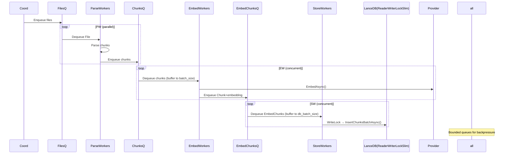

# C# Indexing Flow Design

> **Spec Version:** 1.0 | **Code:** TBD | **Status:** draft

## Background

**Problem:** Efficiently index large codebases for semantic code search in C#, handling parsing, chunking, embedding generation, and storage while minimizing redundant computation through change detection and diffing.

**Impact:** Developers/AI agents affected; high severity for monorepos (10k+ files) where naive reindexing takes hours.

| Metric | Current | Target | Failure |
|--------|---------|--------|---------|
| Indexing Time (10k files) | ~15min | <5min | >30min |
| Embedding Reuse Rate | 80% | >95% | <50% |
| Fragment Count (post-index) | <25 | <10 | >100 |

---

## Architecture

### Modules

| Module | Responsibility | Boundary | Trace |
|--------|---------------|----------|-------|
| IndexingCoordinator | Orchestrates discovery→parse→store→embed pipeline with parallelism and diffing | `ChunkHound.Services.IndexingCoordinator` | `IndexingCoordinator.cs:127` |
| UniversalParser | Tree-sitter based parsing with cAST chunking algorithm | `ChunkHound.Parsers.UniversalParser` | `UniversalParser.cs:89` |
| ChunkCacheService | Content-based chunk diffing for embedding reuse | `ChunkHound.Services.ChunkCacheService` | `ChunkCacheService.cs:19` |
| BatchProcessor | Parallel file batch processing worker | `ChunkHound.Services.BatchProcessor` | `BatchProcessor.cs:165` |
| EmbeddingService | Batched embedding generation with error recovery | `ChunkHound.Services.EmbeddingService` | `EmbeddingService.cs:343` |
| LanceDBProvider | Vector DB storage with fragment optimization and schema management | `ChunkHound.Providers.Database.LanceDBProvider` | `LanceDBProvider.cs:192` |

### Contracts

> Internal APIs between modules. Changes require version bump.

| Provider | Consumer | Contract | Breaking Change Policy |
|----------|----------|----------|------------------------|
| IDatabaseProvider | IndexingCoordinator/StoreWorker | `Task<List<int>> InsertChunksBatchAsync(List<Chunk> chunks)` | semver major |
| IEmbeddingProvider | EmbedWorker | `Task<List<List<float>>> EmbedAsync(List<string> texts)` | notify |
| IUniversalParser | ParseWorker | `Task<List<Chunk>> ParseFileAsync(string path, int fileId)` | semver major |
| IChunkCacheService | StoreWorker | `ChunkDiff DiffChunks(List<Chunk> newChunks, List<Chunk> existingChunks)` | none |

### Boundaries

- **IndexingCoordinator** - NEVER import parsers directly - use factory
- **Services** - MAY import providers via interfaces only
- **Shared kernel:** `ChunkHound.Core.Models` - Chunk, File, Embedding
- **C#:** ReaderWriterLockSlim for concurrent reads/writes on DB

### Integration Points

| Point | Type | Owner | Consumers |
|-------|------|-------|-----------|
| ProcessDirectory | async | IndexingCoordinator | CLI |
| GenerateEmbeddingsBatch | async | IEmbeddingProvider | EmbedWorkers |

---

## Interfaces

### Inputs

| Name | Type | Source | Validation | Trace |
|------|------|--------|------------|-------|
| directory | string | CLI | exists, readable | `IndexingCoordinator.cs:1042` |
| patterns | List<string> | Config | fnmatch | `IndexingCoordinator.cs:1043` |
| excludePatterns | List<string> | Config | gitignore | `IndexingCoordinator.cs:1046` |
| chunksBatch | List<Chunk> | ParseWorker | valid | EmbedWorker |

### Outputs

| Name | Type | Destination | Format | Trace |
|------|------|-------------|--------|-------|
| stats | Dictionary<string, object> | CLI | JSON | `IndexingCoordinator.cs:1484` |
| chunkIds | List<int> | Coord | sequential | `LanceDBProvider.cs:1045` |

---

## State

### Entities

| Entity | Persistence | Storage | Owner |
|--------|-------------|---------|-------|
| File | persistent | LanceDB files table | LanceDB `LanceDBProvider.cs:47` |
| Chunk | persistent | LanceDB chunks (embedding inline) | LanceDB `LanceDBProvider.cs:64` |

**Schema Mgmt:** PyArrow schemas; migrate add_columns/recreate for dims `LanceDBProvider.cs:363`

### Error States

| Code | Meaning | Recovery | Trace |
|------|---------|----------|-------|
| DiskExceeded | Size limit | Abort | `IndexingCoordinator.cs:754` |
| ParseTimeout | Slow file | Skip | `IndexingCoordinator.cs:606` |

### State Model

Declarative: DB tables converge to indexed state via pipeline.

---

## Constraints

| ID | Rule | Verified By | Data | Stress |
|----|------|-------------|------|--------|
| C-001 | Batch thresholds | Worker buffers | Config | High load |
| C-002 | DB RW lock | ReaderWriterLockSlim | Tests | 32 threads |

---

## Flows

### Startup (CLI)

CLI parse → Config → DB connect/schema → Coord init → Pipeline start

### C# Pipeline Flow (Batched)

**Parse chunks → Embed batch → Store batch (chunk+embedding)**

Workers batch internally before API/DB calls.

---

## Migration Strategy

1. **Define Core Models:** Implement ChunkHound.Core.Models (File, Chunk, Embedding) with C# classes and serialization.
2. **Implement Parsers:** Port UniversalParser using Tree-sitter .NET bindings.
3. **Database Provider:** Create LanceDBProvider with async methods and ReaderWriterLockSlim.
4. **Services Layer:** Implement IndexingCoordinator, EmbeddingService, etc., with async/await patterns.
5. **Workers and Queues:** Use ConcurrentQueue and Task-based parallelism.
6. **Testing:** Port smoke tests and integration tests to C#.
7. **Performance Tuning:** Optimize batch sizes and locking for C# runtime.

---

## Testing Strategy

- **Unit Testing:** Each module will have unit tests covering use cases (e.g., EmbeddingService batching logic, ChunkCacheService diffing).
- **Integration Testing:** Test module interactions (e.g., ParseWorker to ChunkCacheService).
- **E2E Testing:** Full indexing flow with mocked embeddings provider (reference `chunkhound/providers/embeddings/fake_constant_provider.py` for cost-free constant vectors during testing).
- **Performance Testing:** Benchmarks against spec metrics (e.g., <5min for 10k files) using fake provider.

## .NET Dependencies

- **LanceDB:** NuGet package for vector DB (async-compatible).
- **Tree-sitter:** .NET bindings for parsing.
- **Embedding Providers:** Interfaces for OpenAI, etc., with async methods.
- **Async Libraries:** System.Threading.Channels for queues, Task Parallel Library for workers.

## Implementation Notes

- **Async Patterns:** All I/O operations use async/await for scalability.
- **Threading:** ReaderWriterLockSlim for DB access (read for queries, write for inserts).
- **Batching:** Workers buffer operations to configurable batch sizes before API calls.
- **Queues:** ConcurrentQueue for thread-safe producer-consumer patterns.
- **Placeholders:** Detailed module designs to be expanded in separate specs (e.g., UniversalParser design, EmbeddingService design).