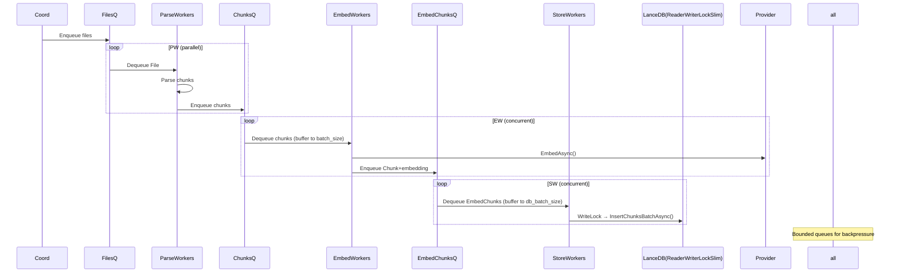

# ParseWorker Service Design Document

> **Spec Version:** 1.0 | **Code:** `ChunkHound.Services.ParseWorker` | **Status:** draft

## Overview

The `ParseWorker` class is a worker component in the ChunkHound C# indexing pipeline responsible for processing files from the discovery phase. This service dequeues discovered files, parses them using appropriate language parsers, and enqueues the resulting semantic chunks for further processing in the embedding and storage phases. It implements async patterns for scalability and handles errors gracefully to maintain pipeline reliability.

This design is derived from the ParseWorkerAsync method in the IndexingCoordinator, extracted into a dedicated worker class for better separation of concerns and testability.

## Pipeline Flow Reference

As defined in the [C# Indexing Flow Design](design.md), the ParseWorker operates within the batched pipeline:



The ParseWorker specifically handles the transition from file discovery to chunk generation, converting raw source files into semantic chunks ready for embedding.

## Class Definition

```csharp
using System;
using System.Collections.Concurrent;
using System.Collections.Generic;
using System.Threading;
using System.Threading.Tasks;
using ChunkHound.Core.Models;
using ChunkHound.Core.Types;
using ChunkHound.Interfaces;
using ChunkHound.Parsers;
using Microsoft.Extensions.Logging;

namespace ChunkHound.Services
{
    /// <summary>
    /// Worker that processes files from the discovery queue, parses them into chunks,
    /// and enqueues chunks for embedding. This worker runs continuously until cancelled,
    /// processing files in a producer-consumer pattern.
    /// </summary>
    public class ParseWorker : IParseWorker
    {
        // Properties and methods defined below
    }
}
```

## Properties

| Property | Type | Description |
|----------|------|-------------|
| `FilesQueue` | `ConcurrentQueue<string>` | Thread-safe queue for incoming file paths |
| `ChunksQueue` | `ConcurrentQueue<Chunk>` | Thread-safe queue for outgoing parsed chunks |
| `LanguageParsers` | `Dictionary<Language, IUniversalParser>` | Mapping of language to parser implementations |
| `Logger` | `ILogger<ParseWorker>` | Logger for diagnostic information |
| `WorkerId` | `int` | Unique identifier for this worker instance |

## Constructor and Dependencies

```csharp
/// <summary>
/// Initializes a new instance of the ParseWorker class.
/// </summary>
public ParseWorker(
    ConcurrentQueue<string> filesQueue,
    ConcurrentQueue<Chunk> chunksQueue,
    Dictionary<Language, IUniversalParser> languageParsers,
    int workerId = 0,
    ILogger<ParseWorker>? logger = null)
{
    FilesQueue = filesQueue ?? throw new ArgumentNullException(nameof(filesQueue));
    ChunksQueue = chunksQueue ?? throw new ArgumentNullException(nameof(chunksQueue));
    LanguageParsers = languageParsers ?? throw new ArgumentNullException(nameof(languageParsers));
    WorkerId = workerId;
    Logger = logger ?? NullLogger<ParseWorker>.Instance;

    // Initialize statistics
    _totalFilesProcessed = 0;
    _totalChunksGenerated = 0;
}

// Private fields
private readonly ILogger<ParseWorker> _logger;
private long _totalFilesProcessed;
private long _totalChunksGenerated;
```

## Core Methods

### RunAsync

```csharp
/// <summary>
/// Runs the worker loop, continuously processing files until cancelled.
/// </summary>
public async Task RunAsync(CancellationToken cancellationToken = default)
{
    Logger.LogInformation("ParseWorker {WorkerId} starting", WorkerId);

    while (!cancellationToken.IsCancellationRequested)
    {
        try
        {
            var filePath = await DequeueFileAsync(cancellationToken);
            if (filePath == null)
            {
                // Queue is empty, small delay to prevent busy waiting
                await Task.Delay(10, cancellationToken);
                continue;
            }

            var chunks = await ParseFileAsync(filePath, cancellationToken);
            await EnqueueChunksAsync(chunks, cancellationToken);

            Interlocked.Increment(ref _totalFilesProcessed);
        }
        catch (OperationCanceledException)
        {
            // Normal cancellation, break the loop
            break;
        }
        catch (Exception ex)
        {
            Logger.LogError(ex, "ParseWorker {WorkerId} encountered error", WorkerId);
            // Continue processing other files despite errors
        }
    }

    Logger.LogInformation("ParseWorker {WorkerId} stopping. Processed {Files} files, generated {Chunks} chunks",
        WorkerId, _totalFilesProcessed, _totalChunksGenerated);
}
```

### DequeueFileAsync

```csharp
/// <summary>
/// Dequeues the next file path from the files queue.
/// </summary>
private async Task<string?> DequeueFileAsync(CancellationToken cancellationToken)
{
    string? filePath = null;

    // Use Task.Run for the synchronous dequeue operation
    await Task.Run(() =>
    {
        if (FilesQueue.TryDequeue(out var path))
        {
            filePath = path;
        }
    }, cancellationToken);

    if (filePath != null)
    {
        Logger.LogDebug("ParseWorker {WorkerId} dequeued file: {FilePath}", WorkerId, filePath);
    }

    return filePath;
}
```

### ParseFileAsync

```csharp
/// <summary>
/// Parses a file using the appropriate language parser.
/// </summary>
private async Task<List<Chunk>> ParseFileAsync(string filePath, CancellationToken cancellationToken)
{
    Logger.LogInformation("ParseWorker {WorkerId} parsing file: {FilePath}", WorkerId, filePath);

    try
    {
        // Detect language from file extension
        var language = DetectLanguageFromPath(filePath);
        if (language == Language.Unknown)
        {
            Logger.LogWarning("ParseWorker {WorkerId} skipping unsupported file: {FilePath}", WorkerId, filePath);
            return new List<Chunk>();
        }

        // Get appropriate parser
        if (!LanguageParsers.TryGetValue(language, out var parser))
        {
            Logger.LogWarning("ParseWorker {WorkerId} no parser available for language {Language}: {FilePath}",
                WorkerId, language, filePath);
            return new List<Chunk>();
        }

        // Parse file (this will assign fileId internally or via coordination)
        // Note: FileId assignment would typically be handled by the coordinator
        // For now, use a placeholder - in production this would be coordinated
        var fileId = await GetOrCreateFileIdAsync(filePath, cancellationToken);

        var chunks = await parser.ParseFileAsync(filePath, fileId, cancellationToken);

        Logger.LogInformation("ParseWorker {WorkerId} parsed {FilePath}: {ChunkCount} chunks",
            WorkerId, filePath, chunks.Count);

        return chunks;
    }
    catch (Exception ex)
    {
        Logger.LogError(ex, "ParseWorker {WorkerId} failed to parse file: {FilePath}", WorkerId, filePath);
        return new List<Chunk>();
    }
}
```

### EnqueueChunksAsync

```csharp
/// <summary>
/// Enqueues parsed chunks to the chunks queue.
/// </summary>
private async Task EnqueueChunksAsync(List<Chunk> chunks, CancellationToken cancellationToken)
{
    if (!chunks.Any())
    {
        return;
    }

    // Use Task.Run for the synchronous enqueue operations
    await Task.Run(() =>
    {
        foreach (var chunk in chunks)
        {
            ChunksQueue.Enqueue(chunk);
        }
    }, cancellationToken);

    Interlocked.Add(ref _totalChunksGenerated, chunks.Count);

    Logger.LogDebug("ParseWorker {WorkerId} enqueued {ChunkCount} chunks", WorkerId, chunks.Count);
}
```

## Helper Methods

### DetectLanguageFromPath

```csharp
/// <summary>
/// Detects programming language from file path.
/// </summary>
private Language DetectLanguageFromPath(string filePath)
{
    var extension = Path.GetExtension(filePath).ToLowerInvariant();

    return extension switch
    {
        ".cs" => Language.CSharp,
        ".js" => Language.JavaScript,
        ".ts" => Language.TypeScript,
        ".py" => Language.Python,
        ".java" => Language.Java,
        ".cpp" or ".cc" or ".cxx" => Language.Cpp,
        ".c" => Language.C,
        ".go" => Language.Go,
        ".rs" => Language.Rust,
        ".php" => Language.Php,
        ".rb" => Language.Ruby,
        ".swift" => Language.Swift,
        ".kt" => Language.Kotlin,
        ".scala" => Language.Scala,
        ".md" => Language.Markdown,
        ".txt" => Language.Text,
        _ => Language.Unknown
    };
}
```

### GetOrCreateFileIdAsync

```csharp
/// <summary>
/// Gets or creates a file ID for the given path.
/// Note: In production, this would be coordinated with the database.
/// </summary>
private async Task<int> GetOrCreateFileIdAsync(string filePath, CancellationToken cancellationToken)
{
    // Placeholder implementation - in real coordinator, this would be handled
    // by checking database and assigning IDs atomically
    // For design purposes, return a hash-based ID
    var hash = filePath.GetHashCode();
    return Math.Abs(hash);
}
```

## Error Handling and Resilience

The ParseWorker implements several resilience patterns:

- **Graceful Error Handling**: Individual file parsing failures don't stop the worker
- **Cancellation Support**: Responds to cancellation tokens for clean shutdown
- **Logging**: Comprehensive logging for monitoring and debugging
- **Statistics Tracking**: Thread-safe counters for monitoring throughput

## Testing Stubs

### Unit Tests

```csharp
using Xunit;
using Moq;
using ChunkHound.Services;
using ChunkHound.Parsers;
using ChunkHound.Core.Models;
using ChunkHound.Core.Types;
using ChunkHound.Interfaces;
using System.Collections.Concurrent;
using System.Threading.Tasks;

namespace ChunkHound.Services.Tests
{
    public class ParseWorkerTests
    {
        private readonly ConcurrentQueue<string> _filesQueue;
        private readonly ConcurrentQueue<Chunk> _chunksQueue;
        private readonly Mock<IUniversalParser> _mockParser;
        private readonly Dictionary<Language, IUniversalParser> _parsers;
        private readonly ParseWorker _worker;

        public ParseWorkerTests()
        {
            _filesQueue = new ConcurrentQueue<string>();
            _chunksQueue = new ConcurrentQueue<Chunk>();
            _mockParser = new Mock<IUniversalParser>();
            _parsers = new Dictionary<Language, IUniversalParser>
            {
                [Language.CSharp] = _mockParser.Object
            };
            _worker = new ParseWorker(_filesQueue, _chunksQueue, _parsers, 1);
        }

        [Fact]
        public async Task RunAsync_WithValidFile_EnqueuesChunks()
        {
            // Arrange
            var filePath = "test.cs";
            var expectedChunks = new List<Chunk>
            {
                new Chunk("TestClass", 1, 3, "class TestClass {}", ChunkType.Class, 1, Language.CSharp)
            };

            _filesQueue.Enqueue(filePath);
            _mockParser.Setup(p => p.ParseFileAsync(filePath, It.IsAny<int>(), default))
                      .ReturnsAsync(expectedChunks);

            // Act
            var cts = new CancellationTokenSource();
            cts.CancelAfter(100); // Short timeout for test
            await _worker.RunAsync(cts.Token);

            // Assert
            Assert.True(_chunksQueue.TryDequeue(out var chunk));
            Assert.Equal("TestClass", chunk.Symbol);
        }

        [Fact]
        public async Task ParseFileAsync_UnsupportedLanguage_ReturnsEmptyList()
        {
            // Arrange
            var filePath = "test.unknown";

            // Act
            var result = await typeof(ParseWorker).GetMethod("ParseFileAsync",
                System.Reflection.BindingFlags.NonPublic | System.Reflection.BindingFlags.Instance)
                .Invoke(_worker, new object[] { filePath, CancellationToken.None }) as List<Chunk>;

            // Assert
            Assert.Empty(result);
        }

        [Fact]
        public void DetectLanguageFromPath_CSharpFile_ReturnsCSharp()
        {
            // Arrange
            var filePath = "Program.cs";

            // Act
            var method = typeof(ParseWorker).GetMethod("DetectLanguageFromPath",
                System.Reflection.BindingFlags.NonPublic | System.Reflection.BindingFlags.Instance);
            var result = (Language)method.Invoke(_worker, new object[] { filePath });

            // Assert
            Assert.Equal(Language.CSharp, result);
        }
    }
}
```

### Integration Tests

```csharp
using Xunit;
using ChunkHound.Services;
using ChunkHound.Parsers;
using System.Collections.Concurrent;
using System.IO;
using System.Threading.Tasks;

namespace ChunkHound.Services.IntegrationTests
{
    public class ParseWorkerIntegrationTests : IDisposable
    {
        private readonly string _testDir;
        private readonly ConcurrentQueue<string> _filesQueue;
        private readonly ConcurrentQueue<Chunk> _chunksQueue;
        private readonly ParseWorker _worker;

        public ParseWorkerIntegrationTests()
        {
            _testDir = Path.Combine(Path.GetTempPath(), "ParseWorkerTest");
            Directory.CreateDirectory(_testDir);

            _filesQueue = new ConcurrentQueue<string>();
            _chunksQueue = new ConcurrentQueue<Chunk>();

            // Setup with real parser for integration testing
            var parsers = new Dictionary<Language, IUniversalParser>();
            // Note: Would need actual parser implementations for full integration test

            _worker = new ParseWorker(_filesQueue, _chunksQueue, parsers, 1);
        }

        [Fact]
        public async Task RunAsync_WithRealFile_ProcessesSuccessfully()
        {
            // Arrange
            var testFile = Path.Combine(_testDir, "test.cs");
            await File.WriteAllTextAsync(testFile, @"
using System;

namespace TestNamespace
{
    public class TestClass
    {
        public void TestMethod() { }
    }
}
");

            _filesQueue.Enqueue(testFile);

            // Act
            var cts = new CancellationTokenSource();
            cts.CancelAfter(5000); // Allow time for processing
            await _worker.RunAsync(cts.Token);

            // Assert
            // Note: Would assert chunks were enqueued if parsers were configured
            Assert.True(true); // Placeholder - actual assertions depend on parser setup
        }

        public void Dispose()
        {
            Directory.Delete(_testDir, true);
        }
    }
}
```

## Dependencies

- `ChunkHound.Interfaces.IParseWorker`
- `ChunkHound.Parsers.IUniversalParser`
- `ChunkHound.Core.Models.Chunk`
- `ChunkHound.Core.Types.Language`
- `Microsoft.Extensions.Logging`
- `System.Collections.Concurrent`
- `System.Threading`

## Interfaces

### IParseWorker

```csharp
/// <summary>
/// Interface for parse worker services.
/// </summary>
public interface IParseWorker
{
    /// <summary>
    /// Runs the worker loop to process files.
    /// </summary>
    Task RunAsync(CancellationToken cancellationToken = default);
}
```

## Notes

- This worker follows the producer-consumer pattern for efficient parallel processing
- Thread-safe queues ensure safe concurrent access from multiple workers
- Async patterns prevent blocking operations and support cancellation
- Error isolation ensures one file failure doesn't stop the entire pipeline
- Statistics tracking enables monitoring of worker performance
- Language detection is based on file extensions for simplicity
- File ID management would typically be coordinated with the database layer
- The design supports horizontal scaling by running multiple worker instances