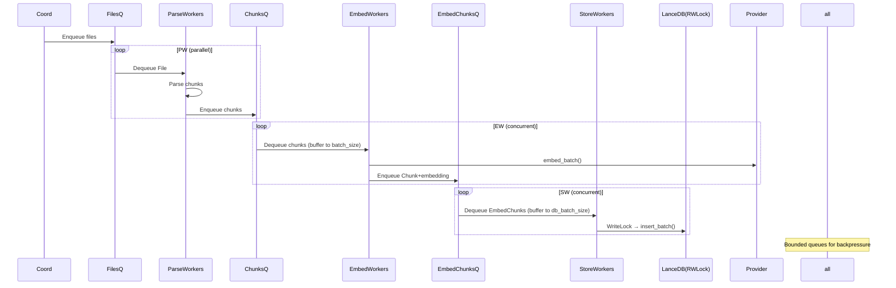

# Indexing Flow

> **Spec Version:** 1.5 | **Code:** `git:HEAD` | **Status:** complete

## Background

**Problem:** Efficiently index large codebases for semantic code search, handling parsing, chunking, embedding generation, and storage while minimizing redundant computation through change detection and diffing.

**Impact:** Developers/AI agents affected; high severity for monorepos (10k+ files) where naive reindexing takes hours.

| Metric | Current | Target | Failure |
|--------|---------|--------|---------|
| Indexing Time (10k files) | ~15min | <5min | >30min |
| Embedding Reuse Rate | 80% | >95% | <50% |
| Fragment Count (post-index) | <25 | <10 | >100 |

---

## Map Architecture

### Modules

| Module | Responsibility | Boundary | Trace |
|--------|---------------|----------|-------|
| IndexingCoordinator | Orchestrates discovery→parse→store→embed pipeline with parallelism and diffing | `chunkhound/services/indexing_coordinator.py` | [`indexing_coordinator.py`](chunkhound/services/indexing_coordinator.py:127):class IndexingCoordinator |
| UniversalParser | Tree-sitter based parsing with cAST chunking algorithm | `chunkhound/parsers/universal_parser.py` | [`universal_parser.py`](chunkhound/parsers/universal_parser.py:89) |
| ChunkCacheService | Content-based chunk diffing for embedding reuse | `chunkhound/services/chunk_cache_service.py` | [`chunk_cache_service.py`](chunkhound/services/chunk_cache_service.py:19) |
| BatchProcessor | Parallel file batch processing worker | `chunkhound/services/batch_processor.py` | [`batch_processor.py`](chunkhound/services/batch_processor.py:165):process_file_batch() |
| EmbeddingService | Batched embedding generation with error recovery | `chunkhound/services/embedding_service.py` | [`embedding_service.py`](chunkhound/services/embedding_service.py:343):class EmbeddingService |
| LanceDBProvider | Vector DB storage with fragment optimization and schema management | `chunkhound/providers/database/lancedb_provider.py` | [`lancedb_provider.py`](chunkhound/providers/database/lancedb_provider.py:192):class LanceDBProvider |

### Contracts

> Internal APIs between modules. Changes require version bump.

| Provider | Consumer | Contract | Breaking Change Policy |
|----------|----------|----------|------------------------|
| DatabaseProvider | IndexingCoordinator/StoreWorker | `insert_chunks_batch(list[Chunk]) -> list[int]` | semver major |
| EmbeddingProvider | EmbedWorker | `embed(list[str]) -> list[list[float]]` | notify |
| UniversalParser | ParseWorker | `parse_file(path: Path, file_id: int) -> list[Chunk]` | semver major |
| ChunkCacheService | StoreWorker | `diff_chunks(new: list[Chunk], existing: list[Chunk]) -> ChunkDiff` | none |

### Boundaries

- **IndexingCoordinator** - NEVER import parsers directly - use factory [`chunkhound/services/indexing_coordinator.py`](chunkhound/services/indexing_coordinator.py:211)
- **Services** - MAY import providers via interfaces only
- **Shared kernel:** `chunkhound/core/models/` - Chunk, File, Embedding
- **C#:** DB ReaderWriterLockSlim for concurrent reads/writes

### Integration Points

| Point | Type | Owner | Consumers |
|-------|------|-------|-----------|
| process_directory | sync | IndexingCoordinator | CLI |
| generate_embeddings_batch | async | EmbeddingProvider | EmbedWorkers |

---

## Define Interfaces

### Inputs

| Name | Type | Source | Validation | Trace |
|------|------|--------|------------|-------|
| directory | Path | CLI | exists, readable | [`indexing_coordinator.py`](chunkhound/services/indexing_coordinator.py:1042) |
| patterns | list[str] | Config | fnmatch | [`indexing_coordinator.py`](chunkhound/services/indexing_coordinator.py:1043) |
| exclude_patterns | list[str] | Config | gitignore | [`indexing_coordinator.py`](chunkhound/services/indexing_coordinator.py:1046) |
| chunks_batch | list[Chunk] | ParseWorker | valid | EmbedWorker |

### Outputs

| Name | Type | Destination | Format | Trace |
|------|------|-------------|--------|-------|
| stats | dict | CLI | JSON | [`indexing_coordinator.py`](chunkhound/services/indexing_coordinator.py:1484) |
| chunk_ids | list[int] | Coord | sequential | [`lancedb_provider.py`](chunkhound/providers/database/lancedb_provider.py:1045) |

---

## Define State

### Entities

| Entity | Persistence | Storage | Owner |
|--------|-------------|---------|-------|
| File | persistent | LanceDB files table | LanceDB [`lancedb_provider.py`](chunkhound/providers/database/lancedb_provider.py:47) |
| Chunk | persistent | LanceDB chunks (embedding inline) | LanceDB [`lancedb_provider.py`](chunkhound/providers/database/lancedb_provider.py:64) |

**Schema Mgmt:** PyArrow schemas; migrate add_columns/recreate for dims [`lancedb_provider.py`](chunkhound/providers/database/lancedb_provider.py:363)

### Error States

| Code | Meaning | Recovery | Trace |
|------|---------|----------|-------|
| DiskExceeded | Size limit | Abort | [`indexing_coordinator.py`](chunkhound/services/indexing_coordinator.py:754) |
| ParseTimeout | Slow file | Skip | [`indexing_coordinator.py`](chunkhound/services/indexing_coordinator.py:606) |

### State Model

Declarative: DB tables converge to indexed state via pipeline.

---

## Enforce Constraints

| ID | Rule | Verified By | Data | Stress |
|----|------|-------------|------|--------|
| C-001 | Batch thresholds | Worker buffers | Config | High load |
| C-002 | DB RW lock | LockSlim | Tests | 32 threads |

---

## Trace Flows

### Startup (CLI)

CLI parse → Config → DB connect/schema → Coord init → Pipeline start

### Current Python Flow

Discovery → Cleanup → ChangeDetect → ParseParallel → EmbedBatch → StoreSerial(Diff)

### C# Pipeline Flow (Batched)

**Parse chunks → Embed batch → Store batch (chunk+embedding)**

Workers batch internally before API/DB calls.

---

## Initialize System

| Order | Component | Depends On | Ready When | On Fail |
|-------|-----------|------------|------------|---------|
| 1 | CLI/Config | - | Validated | Exit |
| 2 | DBProvider | Config | Schema ready | Recreate |
| 3 | Pipeline | DB/Provider | Workers/Queues running | Abort |

---

## Secure System

N/A

---

## Observe System

**Logging (C#):** ILogger + RollingFileHandler (timestamped), SpectreConsoleHandler

**Metrics:** Queue depths, batch sizes, throughput/stage

---

## C# Implementation Notes

- **Queues:** ConcurrentQueue or TPL Dataflow BatchingBlock
- **Workers:** Parallel.ForEach or ActionBlock
- **Batching:** Buffer in worker to configurable batch_size before API/DB call
- **Locks:** ReaderWriterLockSlim (read for diff/query, write for insert)

---

## Plan Deployment

N/A (self-contained CLI)
